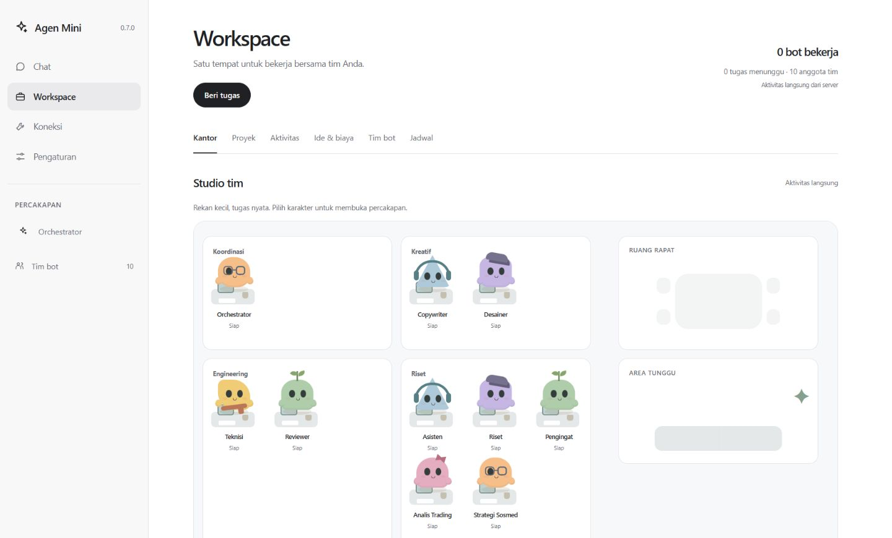
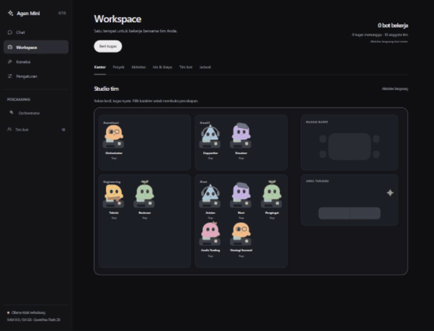
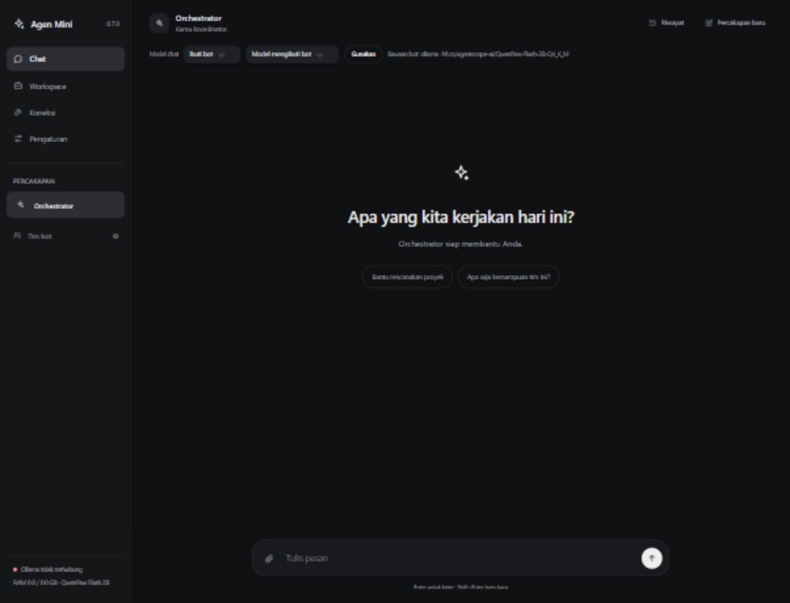
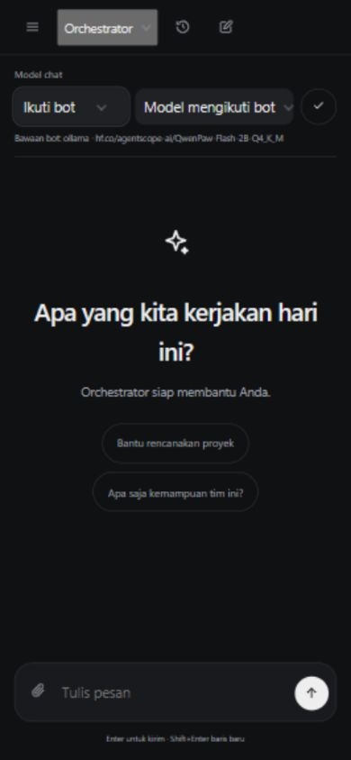
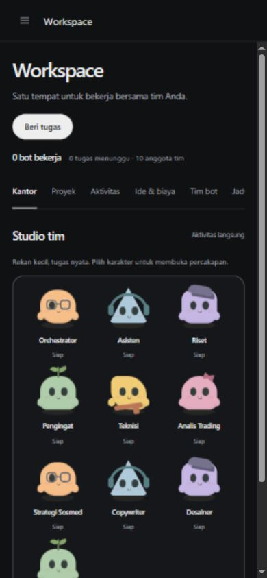
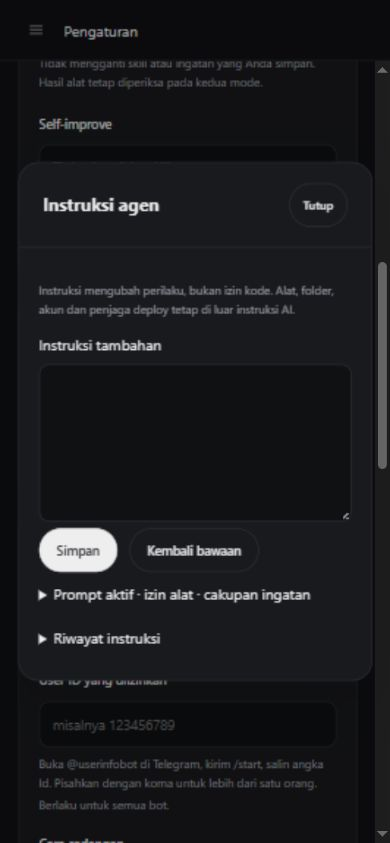

# Agen Mini

[](https://github.com/Zwart04/agenmini/actions/workflows/test.yml)
[](https://github.com/Zwart04/agenmini/actions/workflows/windows.yml)

[Unduh aplikasi](https://github.com/Zwart04/agenmini/releases/latest) · [Instalasi Windows](CARA-PASANG-WINDOWS.txt) · [Instalasi Linux](CARA-PASANG-VPS.txt) · [Batas pengujian](VALIDATION.md)

Asisten AI dengan chat web, Telegram, tim bot dan proyek bertahap. Agen Mini memakai HTML/CSS/JavaScript ringan tanpa framework antarmuka. Pilih model lokal melalui llama.cpp atau satu pintu AI terhubung: API kompatibel dan gateway OAuth opsional. Pemilih otomatis mencoba sumber yang benar-benar tersedia.

**Versi stabil: 0.8.0.** Unduh pemasang dari [GitHub Releases](https://github.com/Zwart04/agenmini/releases/latest).

## Tampilan baru



### Preview aplikasi



[Tonton / unduh video MP4](https://raw.githubusercontent.com/Zwart04/agenmini/main/docs/screenshots/preview.mp4) · [Unduh GIF](docs/screenshots/preview.gif)

### Chat dan pengaturan



| Chat mobile | Workspace mobile | Editor harness |
| --- | --- | --- |
|  |  |  |

[Lihat dialog perbaikan aplikasi](docs/screenshots/repair-dialog.jpg) · [Pemilih model custom](docs/screenshots/model-dropdown.jpg)

Preview direkam dari aplikasi lokal dengan data demo terpisah; status model yang belum terhubung tetap terlihat. Bukan demonstrasi model menjawab atau bot bekerja.

Empat menu utama dengan tab yang jelas. Workspace memisahkan kantor, proyek, aktivitas, tim, jadwal serta ide/biaya; desktop menampilkan studio, mobile memakai susunan karakter ringkas. Tema terang/gelap, navigasi keyboard, draft formulir dan indikator aktivitas tetap tersedia tanpa framework atau font eksternal.

## Pilih pemasangan

- **Windows:** unduh installer `.exe` pada [release terbaru](https://github.com/Zwart04/agenmini/releases/latest), jalankan wizard, lalu buka Agen Mini dari Start.
- **VPS Debian/Ubuntu:** gunakan pemasang pada langkah di bawah; Docker belum perlu terpasang sebelumnya.
- **Source:** unduh `agenmini-source.zip` untuk mengembangkan aplikasi. ZIP source tidak berisi akun, database atau model pengguna.

Update dengan pemasang versi baru; **jangan hapus folder data atau model lama**. Buat backup privat dari Pengaturan sebelum update.

## Pasang di VPS Debian / Ubuntu

Jalankan sebagai root pada VPS yang mendukung Docker:

```bash
curl -fL https://github.com/Zwart04/agenmini/releases/latest/download/pasang-vps.sh -o pasang-vps.sh
curl -fL https://github.com/Zwart04/agenmini/releases/latest/download/pasang-vps.sha256 -o pasang-vps.sha256
sha256sum -c pasang-vps.sha256 && bash pasang-vps.sh
```

Alternatif: ekstrak `agenmini-vps.zip`, lalu jalankan `bash pasang-vps.sh`. Pemasang menyiapkan Docker/Compose jika diperlukan dan menampilkan alamat serta sandi. Buka TCP 443 pada firewall VPS. Sertifikat awal bersifat self-signed; browser meminta konfirmasi sertifikat.

Pemasang menawarkan lokal, gateway OAuth, atau API langsung (default paling ringan). Web instalasi baru menawarkan Kosong atau Paket bawaan. Layanan tambahan bersifat opsional; konfigurasi gateway lama tetap didukung tanpa disemai ulang. Untuk pemasangan tanpa prompt: `AGEN_AI_PROFILE=online AGEN_OTOMATIS=1 bash pasang-vps.sh` (profil: `local`, `router`, `free`, `both`, `online`).

Mode API lebih ringan; 2 GB RAM disarankan. Untuk model lokal kecil, mulai dari 4 GB RAM dan 2 CPU. Anggaran model diperiksa dari RAM aktual; kebutuhan disk dan kecepatan bergantung model. Semua bot lokal berbagi satu model aktif, tanpa daemon Ollama. Build dan panggilan lokal berjalan serial untuk membatasi pemakaian RAM.

## Pasang di Windows

Unduh `agenmini-setup-0.8.0-windows-x64.exe` dari halaman release. Jalankan wizard pemasangan dan buka Agen Mini dari menu Start. Data disimpan terpisah di `%LOCALAPPDATA%\AgenMini\data`. Ini pemasang aplikasi, bukan ZIP portable.

Windows native dapat memakai API yang sudah berjalan. Pengelolaan layanan model lokal, 9router dan FreeLLMAPI memerlukan lingkungan Linux/WSL/Docker. Lihat [panduan Windows](CARA-PASANG-WINDOWS.txt).

## Mulai menggunakan

1. Buka **Koneksi**, pilih sumber AI, isi API key atau selesaikan OAuth yang didukung provider. Untuk lokal, pilih model yang sesuai RAM dan tunggu unduh, verifikasi hash serta status siap.
2. Klik **Uji koneksi**, lalu pilih model. Konfigurasi tersimpan belum berarti provider memiliki kuota atau model berhasil menjawab.
3. Buka **Chat** dengan Asisten (profil kosong) atau Orchestrator (paket bawaan). Berikan tujuan, jenis hasil dan kriteria penerimaan yang jelas. Model percakapan dapat dipilih pada chat; bot dapat memiliki pilihan sendiri.
4. Untuk pekerjaan bertahap, buat proyek di **Workspace**. Periksa tahap, hasil tes dan log; jeda atau lanjutkan dari checkpoint. Proyek berpindah ke Selesai setelah tahapnya lulus. Unduh source ZIP dari kartu hasil.
5. Hubungkan Telegram pada **Pengaturan**. Bot utama mengikuti profil yang dipilih; paket bawaan memakai Orchestrator. Gunakan `/model` untuk memilih sumber/model dan `/belajar` untuk melihat kandidat prosedur; riwayat Telegram dapat disalin ke web untuk dilanjutkan.

## Empat menu

| Menu | Fungsi |
| --- | --- |
| Chat | Percakapan, pilihan model, aktivitas alat, riwayat dan unduhan berkas |
| Workspace | Kantor tim bergerak, proyek aktif/selesai, aktivitas, diskusi, token, tim bot dan jadwal |
| Koneksi | Sumber AI, Smart Router, akun host, akun sosial dan MCP |
| Pengaturan | Preferensi, izin tindakan, Telegram, skill, ingatan, backup, update dan diagnostik |

Bagian utama tetap terlihat. Daftar aktivitas, skill dan ingatan memakai halaman ringkas; tombol **Baca lengkap** membuka rincian. Kantor memakai karakter CSS original dengan aksesori dan bubble, bukan aset milik Apple/OpenAI/Grok. Gerakan mengikuti aktivitas server; animasi dan polling dijeda ketika tab tersembunyi.

## Harness, skill, ingatan & self-improve

Setup Kosong berisi satu agen, tanpa prompt harness bawaan, nol skill/ingatan/MCP bawaan dan self-improve mati. Paket bawaan menambahkan tim dan panduan; tidak mengarang fakta tentang pemilik. Pilihan bertahan setelah restart/update. Update instalasi lama mempertahankan data dan konfigurasi; wizard tidak meresetnya.

Setup awal dan Pengaturan Umum menyediakan pilihan **Kosong**, **Agen Mini**, serta runtime asli **Hermes, OpenCode, Claude Code, DeepSeek Harness, oh-my-pi, Pi, Aider, mini-SWE-agent dan Gemini CLI**. Runtime asli diunduh hanya saat dipilih, memakai CLI upstream dan konfigurasi provider/model sendiri; tidak ada semua repo yang di-clone pada pemasangan awal. Lihat [cara pemasangan, versi dan batas integrasi harness](docs/HARNESSES.md). Pilihan belajar Agen Mini tetap Mati/Tinjau/Setelah Sesuai. Akses penuh merupakan pilihan terpisah; batas folder, alat, kredensial dan kuota model tetap berlaku. Untuk model kecil, `find_tools` membuka definisi alat seperlunya dalam izin bot.

Skill hasil belajar berasal dari bukti alat, bukan sapaan, respons gagal atau penilaian sukses oleh model sendiri. Tinjau bukti/langkah pada tab Skill sebelum mengaktifkan. Revisi tersimpan dan bisa dipulihkan. Koreksi menarik kandidat dan menonaktifkan skill hasil belajar yang belum diedit pemilik. Ingatan pribadi harus berlandaskan ucapan pengguna.

[Training model kecil](training/README.md) menjelaskan baseline, ekspor JSONL privat, deduplikasi, validation set, LoRA/QLoRA dan evaluasi GGUF. Tidak ada training berat pada VPS atau klaim model kecil setara frontier. Ekspor SFT jawaban tidak dianggap dataset tool-calling.

## Mengedit agen dan memperbaiki aplikasi

Di **Pengaturan → Umum → Instruksi & perbaikan aplikasi**, buka **Lihat & edit harness** untuk membaca prompt aktif, daftar alat, cakupan ingatan dan instruksi tambahan. Revisi tersimpan; **Kembali bawaan** menghapus instruksi tambahan dengan tetap menyimpan versi sebelumnya. Skill dan ingatan punya editor serta riwayat pemulihan masing-masing. Persona dan izin per bot tetap di **Workspace → Tim bot**. Instruksi prompt tidak menghapus penjaga kode atau memberikan akun yang belum tersambung.

**Minta perbaikan** menerima prompt, bot/model pilihan dan 1–6 berkas source yang relevan. Asisten/Orchestrator juga memiliki `inspect_app` dan `propose_app_change` untuk mengusulkan perubahan dari chat web/Telegram. Proses menampilkan Menunggu/Mengerjakan/Gagal/Dihentikan/Draft, dapat dibatalkan, dan menyimpan hasil di SQLite. Draft berisi diff, source kandidat, hash awal/akhir serta ZIP yang bisa diunduh. Source aktif tidak ditulis; kode AI tidak dieksekusi. Penjaga, akun, konfigurasi, database, workflow dan installer tidak termasuk area edit.

Alur pemasangan perubahan kode: tinjau diff → salin kandidat ke branch terpisah **Zwart04/agenmini** di Windows atau Linux → jalankan GitHub Actions → review keamanan dan fungsi → buat release melalui workflow Publish → pasang release yang lulus. Draft bukan pemasang dan belum menjamin tes integrasi lulus. Hash yang berubah membuat draft kedaluwarsa. Bila model gagal atau proses berhenti, source aktif tetap utuh; status pulih menjadi Dihentikan. Proses ini sengaja tidak melakukan deploy otomatis dari jawaban model.

Untuk memulihkan kode bawaan, gunakan pemasang release stabil resmi, pertahankan folder data dan buat backup privat dahulu. Pemulihan instruksi/skill/ingatan menggunakan riwayat versi di web; jangan menghapus database untuk mereset instruksi.

## Model, alat dan proyek

Smart Router memilih kandidat dari sumber yang terhubung dan mencoba cadangan secara serial ketika permintaan gagal. Model serta sumber aktual dicatat; kuota dan kemampuan tetap mengikuti provider. 9router opsional memakai backend Go yang dipin. Dashboard dapat dibuka melalui sesi Agen Mini tanpa membuka port router ke publik.

Alat meliputi Python, shell, berkas, pencarian/pembacaan web, memori, jadwal, MCP dan delegasi. Orchestrator dapat membuat spesialis dengan izin yang ditentukan, menugaskan pekerjaan dan meminta review. Hasil alat gagal tetap ditandai gagal; checkpoint memerlukan bukti berkas dan tes nyata. Mode **Akses penuh** tersedia di Pengaturan untuk alat yang telah diberikan kepada bot.

Skill menyediakan prosedur desain, coding, anti-slop dan verifikasi; dapat diedit atau diimpor sebagai Markdown. Diskusi tim saat senggang bersifat opsional, termasuk interval satu jam. Saran disimpan sebagai draft; menyimpan pelajaran memperbarui ingatan/prosedur, bukan melatih bobot model. Token berasal dari laporan provider. Biaya merupakan estimasi berdasarkan tarif yang diisi dan kurs bertanggal.

GitHub/Cloudflare dapat mendeteksi kredensial host yang tersedia dan memverifikasi akses. Keberadaan CLI saja tidak berarti akun terhubung. Threads, Instagram profesional, Meta Ads dan YouTube memerlukan aplikasi developer serta izin API resmi. MCP HTTP/stdio memerlukan server dan kredensial yang sesuai; executable stdio harus tersedia pada runtime. Fitur tidak mengaku tersambung hanya karena formulir sudah diisi.

Model kecil maupun API dapat salah. Tidak ada jaminan semua aplikasi kompleks selesai otomatis. Kapasitas model, dependensi proyek, RAM, kredensial dan kriteria penerimaan menentukan hasil. Untuk proyek besar, gunakan tahap kecil dengan build/test yang dapat diperiksa. Lihat [panduan proyek](PROYEK-BESAR.md), [katalog model](MODEL-CATALOG.md), dan [validasi serta batas pengujian](VALIDATION.md).

## Update, backup dan pengelolaan

Jalankan `sudo agen update`, atau ulangi pemasang versi baru. Update mempertahankan `.env`, data, sandi, bot, skill, MCP, riwayat dan konfigurasi provider. Supervisor memeriksa checksum, mencadangkan kode/database dan menunda update saat sibuk. Update otomatis harus diaktifkan sendiri.

Perintah umum: `agen status`, `agen log`, `agen restart`, `agen sandi`, `agen router-log`, `agen lokal-log`, `agen supervisor-log`.

Data VPS berada di `/opt/agenmini/data`. Unduh backup migrasi melalui Pengaturan sebelum reinstall VPS. Backup berisi data privat; simpan terpisah dari repo publik. Pemulihan serta pemasangan dijelaskan di [panduan VPS](CARA-PASANG-VPS.txt).

Hapus layanan sambil menyimpan data: `sudo agen uninstall --yes`. Periksa rencana penghapusan total: `sudo agen uninstall --all --dry-run`. Hapus seluruh Agen Mini **termasuk data dan model**: `sudo agen uninstall --all --yes`. Login host dan aplikasi VPS lain tidak termasuk penghapusan.

## Mengubah tampilan

Semua frontend ada di **[`frontend/`](frontend/README.md)**: markup, tema, CSS, JavaScript, karakter SVG dan penyesuaian dashboard. Unduh [ZIP frontend saja](https://github.com/Zwart04/agenmini/releases/latest/download/agenmini-frontend.zip) untuk diberikan kepada AI/desainer lain; perubahan desain biasa tidak memerlukan berkas backend. Panduan menjelaskan urutan CSS/script, bagian halaman dan cara menguji.

## Pengembangan

Gunakan Python 3.12, Node untuk pemeriksaan JavaScript dan dependensi pada `requirements.lock`. Jalankan regresi dengan direktori data terpisah:

```bash
python -m pip install -r requirements.lock pytest pytest-asyncio
DATA_DIR=/tmp/agenmini-tests PYTHONPATH=. python -m pytest -q
python build_release.py
```

Build release memakai berkas Git yang terlacak; ZIP diperiksa CRC dan SHA256. CI menjalankan regresi Linux dan siklus pemasangan/update/uninstall Windows sebelum publikasi. Jangan commit `.env`, database, kredensial, log pribadi, folder data atau bobot model.

Dropdown, saran model, konfirmasi, input singkat dan notifikasi memakai komponen custom sesuai tema, dengan keyboard/Escape/fokus. Tidak memakai alert/confirm/prompt browser atau library UI tambahan.
