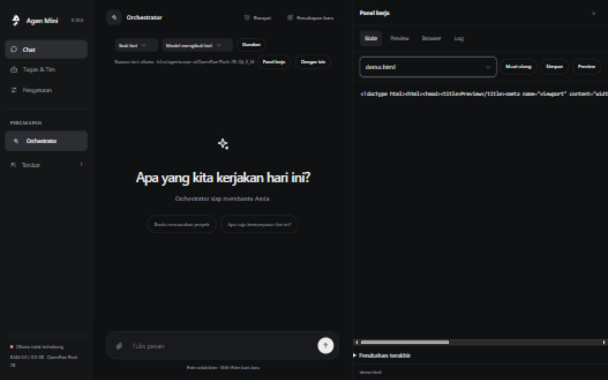
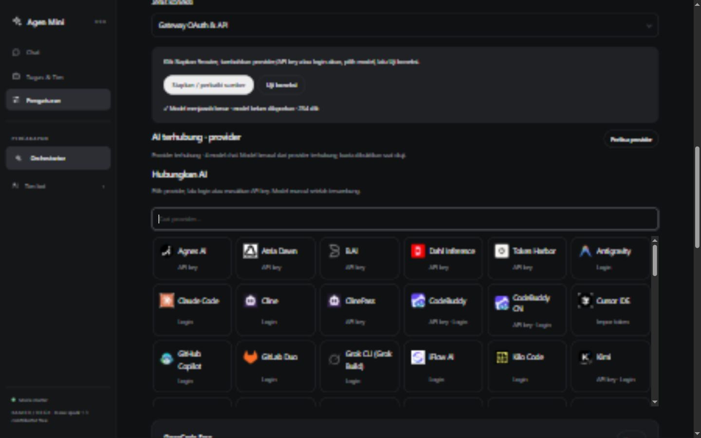

# Agen Mini

[](https://github.com/Zwart04/agenmini/actions/workflows/test.yml)
[](https://github.com/Zwart04/agenmini/actions/workflows/windows.yml)
[](https://github.com/Zwart04/agenmini/actions/workflows/harnesses.yml)

Asisten AI pribadi untuk Windows dan Linux: chat web, Telegram, berkas dan tim bot dalam satu aplikasi. Antarmuka memakai HTML/CSS/JavaScript tanpa framework, font eksternal atau editor besar.

[Unduh release](https://github.com/Zwart04/agenmini/releases/latest) · [Panduan VPS](CARA-PASANG-VPS.txt) · [Panduan Windows](CARA-PASANG-WINDOWS.txt) · [Bukti pengujian](VALIDATION.md)

[Peta folder](docs/PROJECT-MAP.md) · [Audit keamanan](docs/SECURITY-AUDIT.md)

## Chat dan panel kerja



Pilih model pada chat, gunakan **Dengan izin / Akses penuh**, lalu buka **Panel kerja** untuk membaca/edit berkas, melihat perubahan agen, log dan preview. Editor memeriksa hash sebelum menyimpan; bila agen mengubah berkas setelah dibuka, simpan ditolak agar perubahan tidak tertimpa. Salinan sebelum edit disimpan privat, terpisah dari repo.

Preview proyek berjalan di browser Anda dalam iframe terisolasi tanpa akses cookie aplikasi atau jaringan. HTML dengan CSS/JS lokal sederhana didukung; import module, aset luar dan backend perlu server proyek. Tab Browser menampilkan situs yang mengizinkan embedding, dengan **Buka tab** untuk situs yang menolaknya. Panel tampilan ini bukan browser otomatis agen dan tidak menggantikan mesin otomatisasi DOM.

Untuk agen yang hanya membaca web, unduhan HTML adalah pilihan paling ringan. Lightpanda atau Chromium tetap opsional untuk interaksi otomatis; jangan memasangnya hanya untuk memakai panel. Animasi maskot memakai CSS di perangkat pengguna, tanpa server animasi.

## Harness bawaan

**Konteks seperlunya → model memilih tindakan → validasi alat/izin → jalankan berurutan → catat hasil → ulangi → verifikasi → jawab.**

Inti kontrol Agen Mini diadaptasi ke Python dari loop open-source [DeepSeek Harness](https://github.com/deepseek-ai/deepseek-harness), dengan atribusi MIT dan commit sumber tetap. Ada batas langkah/waktu, log tindakan dengan identitas call/result, serta hasil belum diketahui ketika tindakan terputus. Tindakan mutasi tidak otomatis diputar ulang. Web dan Telegram menggunakan `agent.Turn` yang sama.

Ini adaptasi inti tertentu, bukan port penuh Cordis atau CLI DeepSeek. **DeepSeek eksternal asli tetap tersedia** dan dipasang hanya saat dipilih. Kosong, Agen Mini bawaan dan runtime eksternal tetap dibedakan. [Detail adaptasi](docs/DEEPSEEK-CORE.md) · [Runtime asli dan batas integrasi](docs/HARNESSES.md)

Skill dan ingatan dapat dilihat, diedit dan dikosongkan. Self-improve menyimpan prosedur yang dibuktikan dan ditinjau; tidak melatih bobot model. Model kecil masih dapat salah. Harness tidak menjadikannya setara model frontier.

## Satu pintu koneksi AI

Pilih **Pengaturan → Koneksi AI & model** untuk model lokal, API langsung atau gateway OAuth/API. Gateway adalah fork koneksi Go dari [9router-go](https://github.com/luqman-v1/9router-go), berdasarkan [9router](https://github.com/decolua/9router). Tidak menjalankan dashboard kedua atau fitur media/terminal/analitik router.

Katalog berisi 90 provider chat dengan logo asli, termasuk OpenCode Free, MiMo Free dan Devin CLI tanpa login. Tersedia API key, OAuth, refresh token, pemilih model dan fallback. Gratis tetap mengikuti kuota/ketersediaan provider; seluruh akun OAuth belum diuji nyata. Gemini CLI/Antigravity memerlukan client aplikasi Google sesuai [panduan gateway](gateway/README.md).



Gateway memakai binary Go dengan SHA256, tanpa Node/compiler saat instalasi VPS. Batas container gateway 256 MB; pemakaian bergantung beban. Semua bot lokal berbagi satu model aktif melalui llama.cpp. Gateway lama dipertahankan untuk migrasi, tidak menjadi pilihan setup baru.

## Pasang di VPS Debian / Ubuntu

Login sebagai root, lalu jalankan tiga perintah berikut. Tidak perlu Docker sudah terpasang.

```bash
curl -fL https://github.com/Zwart04/agenmini/releases/latest/download/pasang-vps.sh -o pasang-vps.sh
curl -fL https://github.com/Zwart04/agenmini/releases/latest/download/pasang-vps.sha256 -o pasang-vps.sha256
sha256sum -c pasang-vps.sha256 && bash pasang-vps.sh
```

Pemasang memeriksa OS/arsitektur, menyiapkan Docker/Compose, membuat sandi dan menampilkan alamat aplikasi. Buka TCP 443 pada firewall penyedia VPS. Sertifikat awal self-signed. Pilih sandi sendiri/otomatis dan swap opsional; model lokal disarankan mulai dari RAM 4 GB dan 2 CPU. API lebih ringan, RAM 2 GB disarankan. Swap memakai disk dan tidak menggantikan RAM cepat.

Alternatif: unduh `agenmini-vps.zip`, ekstrak, unggah kedua berkas pemasang/checksum ke VPS dan jalankan perintah checksum terakhir di folder yang sama. Source ZIP dipakai untuk pengembangan, bukan pengganti pemasang.

## Update VPS yang sudah terpasang

**Jangan hapus instalasi, model, `data`, atau `.env`.** Buat backup privat di Pengaturan terlebih dahulu.

```bash
agen update
agen status
```

Supervisor memeriksa release dan SHA256, membuat backup, menunggu tugas sibuk selesai, lalu memasang versi baru. Untuk melewati updater lama atau memperbaiki pemasangan yang berhenti, unduh ulang pemasang/checksum dengan tiga perintah instalasi di atas. Jalankan di atas instalasi lama; sandi, bot, skill, riwayat, model dan akun dipertahankan.

Jika versi 0.9.0 gagal saat unduh gateway dengan 404 sesudah checksum pemasang OK, penyebabnya placeholder versi yang belum diganti pada URL binary. Perbaikan mengganti versi pada saat packaging dan memeriksa hash binary sebelum mengganti binary lama. Jangan menghapus model untuk memperbaiki galat ini.

```bash
agen log
agen router-log
agen lokal-log
agen supervisor-log
agen sandi
```

Update otomatis harian tersedia di Pengaturan dan perlu diaktifkan sendiri. Lokasi instalasi `/opt/agenmini`; data privat `/opt/agenmini/data`. Backup tidak boleh diunggah ke repo publik.

## Remove di Linux

Lihat dahulu tindakan yang akan dilakukan:

```bash
agen hapus --dry-run
```

Hapus layanan, **pertahankan data dan model** untuk dipasang kembali:

```bash
agen hapus
```

Hapus seluruh layanan **beserta data/model/akun Agen Mini** setelah backup:

```bash
agen hapus --all
```

Perintah meminta konfirmasi. Tidak mencopot Docker atau menghapus project/container lain. [Detail penghapusan](UNINSTALL.md)

## Windows

Unduh installer `agenmini-setup-VERSI-windows-x64.exe` dari [release terbaru](https://github.com/Zwart04/agenmini/releases/latest). Jalankan wizard dan buka dari Start. Update dengan installer terbaru di lokasi yang sama; data berada di `%LOCALAPPDATA%\AgenMini\data` dan dipertahankan.

Hapus aplikasi melalui **Settings → Apps → Installed apps → Agen Mini → Uninstall**. Data tetap disimpan. Jika ingin menghapusnya permanen, backup dahulu lalu hapus folder data secara manual. Lihat [panduan Windows](CARA-PASANG-WINDOWS.txt).

API yang sudah berjalan dapat digunakan langsung. Pengelolaan otomatis service Linux, swap dan container tidak dijalankan di Windows native; endpoint llama.cpp/gateway lokal yang sudah tersedia dapat dikoneksikan. Tidak perlu memasang WSL hanya untuk memakai API.

## Mulai menggunakan

1. Setup awal selalu dimulai dengan Orchestrator. Pilih isi kosong atau paket bot/skill, lalu harness dan sumber model.
2. Hubungkan sumber AI dan **Uji koneksi**. Key tersimpan atau nama model belum membuktikan provider menjawab.
3. Beri tujuan dan kriteria hasil pada Chat. Pilih model tiap percakapan/bot; lihat kode dan log melalui Panel kerja.
4. Untuk proyek panjang, gunakan **Tugas & Tim** agar ada tahap, bukti, jeda, checkpoint dan ZIP hasil.
5. Hubungkan Telegram melalui Pengaturan. `/model` mengganti model; `/belajar` meninjau prosedur. Alur harness bawaan sama dengan web.
6. Tambahkan MCP/skill hanya bila diperlukan. HTTP MCP lebih mudah untuk VPS; stdio memerlukan executable pada runtime.

| Menu utama | Isi |
| --- | --- |
| Chat | Model, akses, riwayat, berkas dan panel kode/preview/log |
| Tugas & Tim | Orchestrator, spesialis, proyek, aktivitas dan jadwal |
| Pengaturan | Koneksi AI/MCP, harness, skill, ingatan, Telegram, backup dan update |

## Preview aplikasi


[Tonton / unduh MP4](https://raw.githubusercontent.com/Zwart04/agenmini/main/docs/screenshots/preview.mp4) · [Mobile](docs/screenshots/chat-mobile.jpg) · [Panel mobile](docs/screenshots/workbench-mobile-v010.jpg)

Gambar/video adalah preview antarmuka dengan data uji terpisah, bukan bukti model menyelesaikan tugas.

## Pengujian dan pengembangan

Linux diuji pada container GitHub Actions; Windows mencakup pemeriksaan installer nyata. Runtime eksternal diuji pemasangan/CLI secara terpisah; hal itu tidak membuktikan akun provider atau kualitas model.

```bash
python -m pytest tests -q
python scripts/evaluate_apps.py --server-exe /path/llama-server --gguf /path/model.gguf
```

Evaluasi kedua memakai model CPU nyata, data privat baru, tugas converter gambar dan editor teks, tanpa template hasil. Pemeriksaan ZIP/sintaks tidak cukup; unggah, resize, penggantian teks dan download perlu pengujian browser independen. Kanal `tg` menguji jalur agent yang sama, bukan pengiriman ke jaringan Telegram.

[Validasi dan batas pengujian](VALIDATION.md) · [Proyek besar](PROYEK-BESAR.md) · [Model lokal](MODEL-CATALOG.md) · [Lisensi adaptasi](docs/deepseek-harness.LICENSE)
